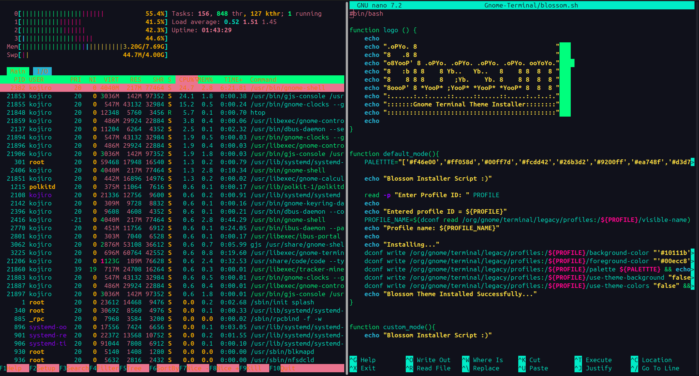
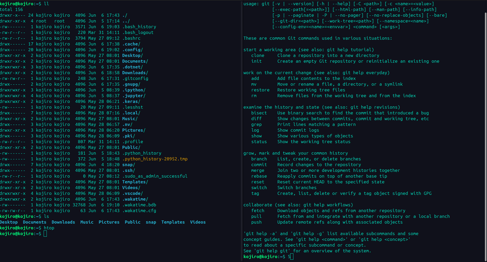

# Blossom Theme for Gnome-Terminal

## Preview



## Installation

Since Gnome-Terminal does not come with an prebuilt method to change it’s theme according to a preconfigured colo palette, many people hav found different ways to do this. The way I prefer to do this is by using a tool called dconf which is a low-level configuration system. Its main purpose is to provide a backend to GSettings on platforms that don’t already have configuration storage systems.

Usage of dconf for writing new values is really easy. The basic syntax is:

```bash
dconf write KEY VALUE
```

But, before applying the theme we should find the key of the gnome-terminal profile we need to install the color theme on. This can be done using:

```bash
dconf dump /org/gnome/terminal/legacy/profiles:/
```

This command will give you a similar output to the below image:


- The visible name key will show the name of the profile (“Blossom” in my case.)
- What we need for this is the key in the first line which starts with a ":"

After obtaining the key, Run the script with a necessary flag to apply the theme

```bash
-d = will apply default settings(blossom color palette)
-c = will allow custom settings(your own color palette)
```

To install the BlossomTheme the command would be, 
```bash
./ blossom.sh -d
```

That's It...
Enjoy!